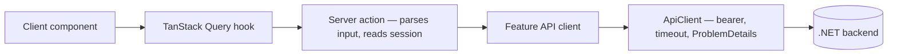

<p align="center">
  
</p>

<h1 align="center">Medical System Gov UI</h1>

<p align="center">
  Bilingual (Arabic-first, RTL / English) web portal for Egypt's national health insurance system.<br />
  التأمين الصحي — بوابة المواطن والممارس والإداري
</p>

<p align="center">
  <a href="https://nextjs.org"></a>
  
  
  
  
  
</p>

## Overview

This repository contains the **frontend** of a government health-insurance platform. It is a Next.js App Router application that talks to a .NET backend (see the OpenAPI contracts in the repo root) and serves three roles from a single codebase:

| Role | Home after login | What they can do |
| --- | --- | --- |
| **Citizen** | `/dashboard` | Register, complete a profile, add dependents, browse categories, enroll with document uploads, track applications, and view a digital insurance card. |
| **Doctor** | `/dashboard/doctor` | Point-of-care desk: verify a card token, check eligibility (GET), record verification decisions, and review history. |
| **Admin** | `/dashboard/admin` | Hero hub into categories, application review queue, card lifecycle, and verification. |

The UI is designed to feel official, calm, and trustworthy (see [PRODUCT.md](PRODUCT.md)) — WCAG AA contrast, Arabic-first with full RTL support, and English as a first-class second locale.

## Key routes

| Route | Purpose |
| --- | --- |
| `/` | Public portal landing (login / register) |
| `/auth/register` | Multi-step citizen registration |
| `/dashboard` | Citizen home: welcome hero, status cards, quick actions |
| `/dashboard/insurance` | Insurance categories landing |
| `/dashboard/insurance/apply` | Enrollment wizard (profile, dependents, documents, review) |
| `/dashboard/insurance/track` | Application status tracking + past applications |
| `/dashboard/insurance-card` | Digital insurance card with status and history |
| `/dashboard/profile` | Profile details, editing, and completeness |
| `/dashboard/doctor` | Doctor point-of-care workspace |
| `/dashboard/admin` | Admin hub (hero + tool shortcuts) |
| `/dashboard/admin/applications` | Review queue and per-application decision |
| `/dashboard/admin/categories` | Category and requirement management |
| `/dashboard/admin/cards` | Card lifecycle per patient |
| `/dashboard/admin/verification` | Card verification desk |

> [!NOTE]
> `/dashboard/appointments` is intentionally a "coming soon" stub — the backend does not implement scheduling yet.
>
> Admin and Doctor who open `/dashboard` are redirected to their role home. Citizen-only status queries are gated so staff never hit patient `/profile` endpoints.

## Tech stack

| Area | Choice |
| --- | --- |
| Framework | Next.js 16 (App Router, Server Actions, React Compiler enabled) |
| UI | React 19, shadcn/ui primitives (Radix), Tailwind CSS v4 (CSS-first tokens in `src/styles/globals.css`), `motion` for animation |
| i18n | `next-intl` — `ar` (default, RTL) and `en`, locale always prefixed |
| Data fetching | TanStack Query on the client; typed feature API clients + Server Actions on the server |
| Forms & validation | `react-hook-form` + `zod` schemas shared by client forms and server action inputs |
| Charts | Recharts |
| Code quality | Biome (lint + format), TypeScript strict mode |
| Testing | Vitest (unit tests for pure feature logic) |

## Architecture

The app uses **feature-based (vertical-slice) architecture**: each domain owns everything it needs, and app-router pages stay thin.

```text
src/
├── app/[locale]/        # Routes only — thin wrappers that delegate to features
├── components/          # Cross-cutting UI: shadcn primitives, AuthGuard, role guards
├── features/
│   ├── auth/            # Session, login/register, QueryProvider, purgeSessionCaches
│   ├── admin/           # Admin hub shell (hero + tool grid)
│   ├── dashboard/       # Shell: sidebar, header, citizen home
│   ├── doctor/          # Point-of-care workspace
│   ├── insurance/       # Shared insurance domain:
│   │   ├── actions/     #   profile + card-state server actions (barrel re-exports)
│   │   ├── enrollment/  #   wizard, tracking, dependents, documents
│   │   ├── card/        #   digital card UI
│   │   ├── profile/     #   profile pages and completeness
│   │   ├── verification/#   shared Admin + Doctor verify/eligibility/record
│   │   ├── admin/       #   review queue, categories, card lifecycle, verification UI
│   │   └── hooks/       #   useActionQuery, session guard, mutation error ladder
│   └── */translations/  # ar.json + en.json per feature
├── i18n/                # next-intl routing, request-time message merging
├── lib/                 # ApiClient, zod-validated env, ProblemDetails parsing
├── styles/              # Tailwind v4 theme tokens (globals.css)
└── proxy.ts             # Next.js middleware: auth-cookie gate + locale negotiation
```

A typical feature module bundles `components/`, `hooks/` (often split into queries/mutations + a barrel), `lib/` (pure, unit-tested logic), `api/` (typed backend clients), `actions/` (`"use server"` leaf modules) + `actions.ts` barrel, `types.ts`, and `translations/{ar,en}.json`.

### Rendering pipeline

A request passes through three gates before a page renders:

1. **`src/proxy.ts`** — Next.js 16 middleware: negotiates the locale and redirects logged-out users away from `/dashboard`.
2. **`AuthGuard`** — mounted in the dashboard layout; verifies the session cookie and redirects on expiry.
3. **Role guards** (`DoctorGuard`, `AdminGuard`, `PatientGuard`, `StaffGuard`) — wrap role-specific pages. These are UI-only; the backend remains the source of truth for authorization.

Post-login navigation uses `dashboardHomePath(role)` so each role lands on the correct desk.

### Data flow

All backend traffic goes through one funnel. Client components read through TanStack Query hooks that call **server actions** (`"use server"`), which parse their input, read the session cookie, invoke a typed feature API client, and return a result object. The shared `ApiClient` (`src/lib/api-client.ts`) attaches the bearer token, applies a 15-second timeout, and converts every failure into a typed `ApiError`.



Business rules that must not break (wizard step derivation, card status transitions, queue filters, file validation…) live in plain functions under each feature's `lib/`, covered by co-located `*.test.ts` files.

> [!IMPORTANT]
> Arabic is the default locale and every layout renders RTL. When adding UI, use logical CSS properties and test in both `ar` and `en` — the shadcn primitives in `src/components/ui` are already RTL-aware.

## Patterns in use

The conventions every feature follows — worth knowing before opening a PR:

| Pattern | How it's applied |
| --- | --- |
| **Result-type server actions** | Leaf `"use server"` modules return `ActionResult<T>` — `{ ok: true, data }` or `{ ok: false, error }` — so errors cross the boundary as values. Barrels re-export without `"use server"`. |
| **Parse at the boundary** | Action inputs are validated and normalized (trimmed, empty → `null`) in pure `lib/parse-*` helpers before any network call. |
| **Discriminated API errors** | `ApiError.kind` (`validation`, `conflict`, `unauthorized`, `forbidden`, `notFound`, `server`, `timeout`, `network`) is mapped from HTTP status and RFC 7807 `ProblemDetails`; callers branch on `kind`. |
| **Session-aware errors** | Expired session clears the cookie and returns `SESSION_EXPIRED_ERROR`; hooks call `purgeSessionCaches` so identity + `insurance` / `admin` / `doctor` PII caches drop together. |
| **Shared query / mutation adapters** | `useActionQuery` and `useActionMutationError` centralize ActionResult → Query throws, terminal retry skips, forbidden toasts, and session expiry. |
| **Query hooks over actions** | Feature `use-*.ts` hooks use factory query keys, skip retries for deterministic failures, and handle session expiry in an effect (TanStack Query v5 has no query-level `onError`). |
| **Server errors → form fields** | `applyActionError` maps `fieldErrors` onto react-hook-form fields (ProblemDetails keys normalized to camelCase), with a root-level fallback so a failure is never silent. |
| **Pure logic, co-located tests** | Business rules live in plain functions in each feature's `lib/`, with `*.test.ts` next to them. |
| **Server-only enforcement** | `ApiClient` and the env module import `server-only`, making it a build error to pull them into a client bundle. |
| **Per-feature i18n** | Each feature ships `translations/ar.json` + `en.json`; `src/i18n/request.ts` merges them into namespaces per request. |
| **Token-driven theming** | Tailwind v4 CSS-first tokens in `src/styles/globals.css`, including semantic status colors (`success`, `warning`, `info`, `revoked`, `superseded`). |

To see these working together, read a leaf action under `src/features/insurance/actions/` and a consumer hook such as `src/features/insurance/hooks/use-card.ts`.

## Getting started

### Prerequisites

- [Node.js](https://nodejs.org) 20.9 or later
- npm (a `package-lock.json` is committed)

### Setup

```bash
npm install
cp .env.example .env.local   # then edit values as needed
npm run dev
```

The app runs at [http://localhost:3000](http://localhost:3000) (redirecting to `/ar` by default).

### Environment variables

Validated at runtime with zod in `src/lib/env.ts` — the app fails fast on missing or malformed values.

| Variable | Required | Description |
| --- | --- | --- |
| `API_BASE_URL` | Yes | Base URL of the backend API, without a trailing slash (e.g. `http://stg-api.runasp.net/api`). |
| `APP_BASE_URL` | Yes in production | Absolute URL the app is served from, without a trailing slash; used for redirect targets. Optional in development. |

## Scripts

| Command | Description |
| --- | --- |
| `npm run dev` | Start the dev server |
| `npm run build` | Production build |
| `npm run start` | Serve the production build |
| `npm run lint` | Lint with Biome (`biome check`) |
| `npm run format` | Auto-format with Biome |
| `npm run test` | Run the Vitest unit-test suite |

## Testing

Vitest runs unit tests for the pure feature logic (`src/**/*.test.ts`, node environment, `@` alias configured in `vitest.config.mts`). Coverage focuses on the rules that would be dangerous to get wrong: wizard step derivation, card status transitions, review-queue filters, document file validation, ProblemDetails parsing, and role home paths. Component and E2E tests are not set up yet.

## Contributing

1. Branch from the active feature/integration branch (or `main` when agreed).
2. Keep pages thin; put logic in the owning feature under `src/features/`.
3. Prefer splitting large files: `"use server"` leaves, pure parsers, presentational UI siblings, query/mutation hooks + barrels that preserve import paths.
4. Add or update co-located unit tests for pure `lib/` changes.
5. Run `npm run lint` and `npm run test` before opening a PR.
6. Use the [pull request template](.github/PULL_REQUEST_TEMPLATE.md) — fill Summary, Test plan, and the checklist.

Do not invent backend capabilities that are not in the OpenAPI contracts. Doctor PoC is bound to `doctor-swagger.json` (no invented visits/search/meds). Eligibility **POST** remains Admin-only where the API says so.

## Working with the backend

The OpenAPI contracts this UI is built against ship in the repo root: `citezen-swagger.json`, `doctor-swagger.json`, and `admin-swagger.json`. For endpoint-by-endpoint mapping, flow diagrams, and role details, see:

- [frontend-integration-guide.md](frontend-integration-guide.md) — full backend contract reference
- [docs/domains.md](docs/domains.md) — domain walkthroughs with UI flow diagrams
- [docs/](docs) — per-area plans (review queue, categories, card lifecycle) and design prototypes

> [!TIP]
> This project runs **Next.js 16**, which differs from earlier versions in several conventions (e.g. `proxy.ts` instead of `middleware.ts`). Read [AGENTS.md](AGENTS.md) before making framework-level changes.
